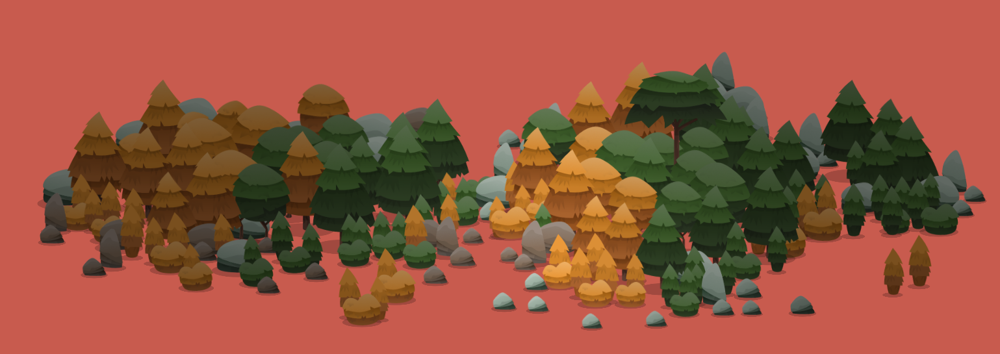

# Vector Forest Scenery
Vector Forest Scenery is a Unity package that helps you build your natural scenery, with minimalistic and interactive items. The package includes 30 items, including trees, bushes, and rocks.

## How to use

### Items

#### Dynamic vs Static
There are two versions of each scenery item in this package, static and dynamic. Dynamic items are composed of at least three renderers, animations (wind, idle, shake, and snow), and one particle system each. If you need to optimize your project, you can use static versions, which are composed of a single renderer and no animations.

#### Interactions
Each dynamic item prefab has a component called SceneryItem attached to it. In order to access the interactions, you can get the SceneryItem component, and call the following methods:

*   **RandomizeSize:** Randomizes the size of the item, according to _\_minSize_ and _\_maxSize_ properties defined in the inspector.
*   **WindLeft:** Swings the item to the left side (doesn't affect stones).
*   **WindRight:** Swings the item to the right side (doesn't affect stones).
*   **Shake:** Shakes the tree, and triggers the particle system.
*   **SnowOn:** Shows snow layers.
*   **SnowOff:** Hides snow layers.
*   **TriggerParticle:** Triggers the particle system (trees and bushes only).

  

#### Other properties
*   **\_randomizeSize:** Randomize automatically item size when it is instantiated.
*   **\_shakeOnStart:** Activate shake animation when the item is instantiated.

### Utils
Included in this package, you'll find a few utility components that help you to interact with your dynamic scenery.

#### Scenery
_Scenery_ is the root component for all your dynamic scenery items. You need to put all the items inside of it before the initialization or add it through its _Add_ method.  

#### Light Variation

This utility component shades the scenery items according to a few parameters that can be passed to its method _SetVariation_ (light origin, distance, and max color variation)_._

#### Wind

The _Wind_ utility allows you to reproduce wind movements in your scenery items by calling the method _StartWind_, according to a few parameters (wind origin, velocity, and max distance).
